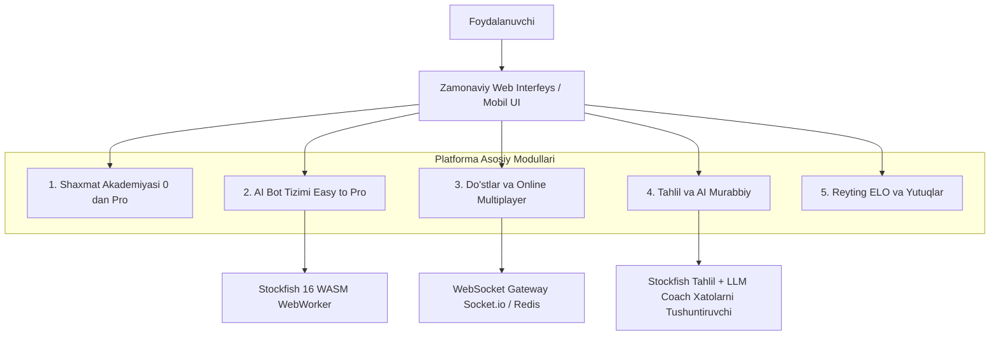

# Shaxmat Ta'lim va O'yin Platformasi — Master Reja (Arxitektura va Bosqichlar)

Ushbu loyiha foydalanuvchilarga shaxmatni **mutlaqo 0 dan boshlab xalqaro grossmeyster (GM/FM) darajasidagi tushunchalargacha** bosqichma-bosqich o'rgatuvchi, turli darajadagi AI robotlar (Easy -> Pro) bilan mashq qilish hamda do'stlar bilan real vaqtda (multiplayer) o'ynash imkoniyatini taqdim etuvchi zamonaviy veb-platformadir.

---

## 1. Platformaning Asosiy Modullari va Funksional Imkoniyatlari

---

## 2. O'quv Dasturi: 0 dan Professional Darajagacha (Curriculum)

O'quv tizimi faqat video yoki matndan iborat bo'lmay, **interaktiv doska** orqali amaliy topshiriqlar bilan o'rgatiladi (Lichess Learn va Chessable uslubida).

### 🟢 1-Bosqich: Boshlang'ich (0 — 1000 ELO) — "Shaxmat Alifbosi"
- **Doska va donalar:**
  - Kataklar nomi (koordinatalar: a1-h8), vertikallar, gorizontallar, diagonallar.
  - Donalarning yurishi va urishi: Piyoda, Ot, Fil, To'ra, Farzin, Shoh.
  - Interaktiv yulduzcha terish mashqlari (donaning yurish trayektoriyasini miyaga singdirish).
- **Maxsus qoidalar:**
  - Roqirovka (Castling) — qisqa va uzun roqirovka shartlari va qachon roqirovka qilib bo'lmasligi.
  - Yo'lda urish (En Passant) — qachon va qanday qoidaga ko'ra bajariladi.
  - Piyodani almashtirish (Promotion).
- **O'yin maqsadlari va yakunlanishi:**
  - Shoh berish (Check), qochish usullari (Shohni qochirish, to'sish, hujum qilgan donani urib olish).
  - Mot (Checkmate) — o'yinning mutlaq g'alabasi.
  - Pat (Stalemate) va durang turlari (3 martalik takrorlanish, 50 yurish qoidasi, yetarli bo'lmagan material).
- **Boshlang'ich motlar:**
  - Farzin bilan mot qilish, To'ra bilan mot qilish, 2 ta To'ra (zinapoya uslubi).
  - Bolalar moti (Scholar's mate) va undan himoyalanish.

### 🟡 2-Bosqich: O'rta Boshlang'ich (1000 — 1400 ELO) — "Taktika va Debyut Asoslari"
- **Donalarning nisbiy qiymati va almashinuvlar:**
  - Piyoda=1, Ot=3, Fil=3 (Ot vs Fil farqlari), To'ra=5, Farzin=9.
- **Asosiy taktik qurollar (Tactics Trainer):**
  - Vilka (Fork) — Ot va Piyoda vilkalari.
  - Bog'lam (Pin) — mutlaq va nisbiy bog'lamlar.
  - Shish (Skewer) — orqadagi qimmatli donani urib olish.
  - Ochib qilingan hujum (Discovered attack) va Ikkitalik shoh (Double check).
  - Donani chalg'itish (Deflection / Decoy), oraliq yurish (Zwischenzug / In-between move).
  - Himoyasiz donalar (Hanging pieces) va taktik kombinatsiyalar.
- **Debyutning oltin qoidalari:**
  - Markazni nazorat qilish (e4, d4, e5, d5).
  - Yengil donalarni (Ot va Fil) tezkor rivojlantirish.
  - Shohni tezroq xavfsiz joyga olish (roqirovka).
  - Bitta dona bilan debyutda 2-3 marta sababsiz yurmaslik.
- **Mashhur ochiq debyutlar bilan tanishuv:**
  - Italiyancha partiya (Giuoco Piano).
  - Ispancha partiya (Ruy Lopez).
  - To'rt ot partiyasi.

### 🟠 3-Bosqich: O'rta Yuqori (1400 — 1800 ELO) — "Strategiya va Pozitsion O'yin"
- **Piyoda tuzilmalari (Pawn Structures):**
  - Izolyatsiyalangan piyoda (IQPs), juftlangan (doubled) piyodalar, o'tkinchi piyoda (passed pawn).
  - Piyoda zanjiri va uning bazasiga hujum qilish.
- **Strategik tushunchalar:**
  - Kuchli va zaif kataklar (Outposts).
  - Ochiq va yarim ochiq vertikallar, 7-chi gorizontalni egallash (To'raning kuchi).
  - Yaxshi va yomon fillar (o'z piyodalari rangiga tushib qolgan fil).
- **Asosiy Endshpil (Yakuniy qism):**
  - Shoh va piyoda endshpili: Kvadrat qoidasi, Oppozitsiya (to'g'ridan-to'g'ri, diagonal, uzoq), Triangulyatsiya.
  - To'ra endshpillari asoslari: Lucena pozitsiyasi (ko'prik qurish) va Philidor himoyasi.
- **Chuqur debyut repertuari:**
  - Sitsilyancha himoya (Sicilian Defense - Najdorf / Dragon asoslari).
  - Fransuzcha va Karokan (Caro-Kann) himoyasi.
  - Vezir gambiti (Queen's Gambit Accepted / Declined).

### 🔴 4-Bosqich: Professional va Grossmeysterlik (1800 — 2400+ ELO) — "Chuqur Hisoblash va Psixologiya"
- **Hisoblash texnikasi (Calculation & Visualization):**
  - Nomzod yurishlar (Candidate moves - Kotov metodi).
  - Chuqur hisoblash shajarasi va yakuniy pozitsiyani to'g'ri baholash (Evaluation).
- **Murakkab pozitsion qurbonliklar:**
  - Pozitsion sifat qurbonligi (Exchange sacrifice - Petrosian uslubi).
  - Dinamik o'yin, temp va hujum tashabbusi (Tal va Kasparov uslubi).
  - Profilaktika (Prophylaxis - raqib rejalarini oldindan bartaraf qilish - Karpov uslubi).
- **Professional Endshpil:**
  - Har xil rangli fillar endshpili (durang tendensiyalari).
  - Murakkab to'ra va piyoda endshpillari (Vancura pozitsiyasi, faol shoh).
  - Fil va Ot bilan mot qilish texnikasi.
- **Grossmeysterlar klassik merosi:**
  - Tarixdagi buyuk partiyalar tahlili (Morfidan tortib Karlsen va Gukeshgacha).

---

## 3. Robot bilan O'ynash Tizimi (Easy dan Pro gacha)

Botlar foydalanuvchining darajasiga qarab to'g'ri moslanishi shart:

| Daraja | Taxminiy ELO | Dvigatel Sozlamasi (Engine Config) | Xususiyatlari |
|---|---|---|---|
| **1. Havaskor (Very Easy)** | 400 - 600 | Stockfish Skill Level 0, Depth 1, Random Error Rate 40% | Donalarni ko'pincha tekinga beradi, oson mot bo'ladi |
| **2. Boshlang'ich (Easy)** | 800 - 1000 | Stockfish Skill Level 2, Depth 2-3, Error Rate 20% | Oddiy qoidalarga amal qiladi, lekin 1-2 yurishli taktikalarni o'tkazib yuboradi |
| **3. O'rta (Medium)** | 1200 - 1400 | Stockfish Skill Level 5, Depth 5-6 | Oddiy xato qilmaydi, debyut asoslariga amal qiladi |
| **4. Kuchli (Hard)** | 1600 - 1800 | Stockfish Skill Level 10, Depth 8-10 | Taktik kombinatsiyalarni ko'radi, pozitsion o'ynaydi |
| **5. Ekspert (Expert)** | 2000 - 2200 | Stockfish Skill Level 15, Depth 12-15 | Ko'p klub o'yinchilaridan ancha kuchli, jiddiy hisoblaydi |
| **6. Professional / Master** | 2400 - 2600 | Stockfish Skill Level 18, Depth 18+ | Master darajasi, deyarli xato qilmaydi |
| **7. Grossmeyster (God Mode)** | 3200+ ELO | Stockfish 16 NNUE to'liq kuchda (Full Depth) | Dunyo chempioni ham yuta olmaydigan maksimal daraja |

### Botlarning qo'shimcha imkoniyatlari:
1. **O'quv yordamchilari:**
   - **Takeback (Yurishni qaytarish):** Xato qilganda qaytib boshqacha yurish imkoniyati.
   - **Hint (Ko'rsatma):** Murakkab vaziyatda optimal yurishni so'rash.
   - **Evaluation Bar (Baho ko'rsatkichi):** Kimning ustunligi borligini (+1.5, -0.8 kabi) real vaqtda ko'rsatish.
2. **Personaj Botlar (Avatarlar):** Har xil uslubdagi botlar (masalan: "Hujumchi Bobur" - faqat qurbonliklar qiladi, "Himoyachi Botir" - mustahkam pozitsiya ushlaydi).

---

## 4. Do'stlar Bilan O'ynash (Multiplayer & Real-Time)

Do'stlar bilan o'ynash quyidagi mexanizmlar orqali tashkil etiladi:

1. **Tezkor havola (Instant Invite Link):**
   - Foydalanuvchi "Do'st bilan o'ynash" tugmasini bosadi va vaqt rejimini tanlaydi (masalan: 5 min, 10 min, 3+2).
   - Unikal havola yaratiladi (masalan: `https://shaxmat.uz/play/room-xyz123`).
   - Do'sti havolani brauzerda ochishi bilan partiya boshlanadi (ro'yxatdan o'tish majburiy emas, mehmon sifatida kirish imkoni).
2. **Vaqt nazorati (Time Controls):**
   - **Bullet:** 1 daqiqa, 1+1 sek.
   - **Blitz:** 3 daqiqa, 3+2 sek, 5 daqiqa.
   - **Rapid:** 10 daqiqa, 15+10 sek.
   - **Cheksiz (No Clock / Correspondence):** Dars yoki do'stona muhokama uchun.
3. **O'yin jarayoni imkoniyatlari:**
   - Real-time Chess Clock (audio effektlar bilan — donani surish, urib olish, shoh berish, vaqt tugashi).
   - O'yin ichidagi chat va reaksiyalar (emojilar).
   - Durang taklif qilish (Offer draw), taslim bo'lish (Resign), partiyani qayta o'ynash (Rematch).
   - Spektator rejimi (boshqa o'rtoqlari o'yinni jonli kuzatishi mumkin).
4. **O'yindan so'ng birgalikda tahlil (Collaborative Analysis Board):**
   - Partiya tugagach, ikki do'st birgalikda doskada yurishlarni tahlil qilib, variatsiyalarni ko'rishi mumkin.

---

## 5. Partiyalarni Tahlil Qilish va Shaxsiy AI Murabbiy (Game Analysis)

Partiya tugagach har bir yurish Stockfish tahlilidan o'tadi:
- **Yurish baholari:**
  - 🌟 **Brilliant (Ajoyib):** Yagona to'g'ri bo'lgan chuqur taktik yoki qurbonlik yurishi.
  - 🟢 **Best / Great (Eng yaxshi):** Kompyuter tavsiya qilgan eng yaxshi yurish.
  - 🔵 **Good (Yaxshi):** Qabul qilsa bo'ladigan barqaror yurish.
  - 🟡 **Inaccuracy (Noaniqlik):** Kichik ustunlikni boy berish (0.5 - 1.0 pawn xatolik).
  - 🟠 **Mistake (Xato):** Vaziyatni sezilarli yomonlashtirish (1.0 - 2.5 pawn).
  - 🔴 **Blunder (Qo'pol xato):** Donani tekinga berish yoki motga olib keluvchi xatolik.
  - ❓ **Missed Win (G'alabani qo'ldan boy berish):** Yutayotgan vaziyatni durang yoki yutqazishga aylantirish.
- **Grafik:** O'yin davomida ustunlik qaysi tarafda bo'lganini ko'rsatuvchi Advantage Chart.
- **Xatolardan saboq olish (Retry your mistakes):** O'yinchining xato qilgan pozitsiyalarini qaytadan berib, to'g'ri yurishni topishga undash.

---

## 6. Tavsiya Etiladigan Texnologiyalar Steki (Tech Stack)

| Qatlam | Texnologiya | Sababi va Afzalligi |
|---|---|---|
| **Frontend Framework** | **Next.js (React 19 / App Router) + TypeScript** | Tezkor SEO, SSR/SSG (darslar uchun), zamonaviy ekotizim |
| **Styling & UI** | **Tailwind CSS + Lucide Icons + Radix UI / Shadcn** | Chiroyli, responsiv va qulay dizayn |
| **Shaxmat Doskasi** | **Chessground** (yoki `react-chessboard`) | Lichess ishlatadigan eng tezkor, animatsiyalari silliq va mobil qurilmalarga mukammal moslashgan doska |
| **Shaxmat Qoidalari** | **chess.js** | Yurishlar validatsiyasi, FEN/PGN formati, shoh/mot/pat tekshiruvlari |
| **AI Dvigateli** | **Stockfish 16 (WASM + Web Worker)** | Brauzerning o'zida mijoz kompyuterida ishlaydi, serverga og'ir yuk tushirmaydi, oflayn ham ishlaydi |
| **Backend & Real-time** | **Node.js (NestJS yoki Express + Socket.io)** | WebSockets orqali o'yinchilar orasida millisekundlik tezkor almashinuv |
| **Ma'lumotlar Bazasi** | **PostgreSQL + Prisma ORM** | Foydalanuvchilar, dars progressi, partiyalar tarixi (PGN), reytinglar uchun ishonchli relational baza |
| **Cache & Realtime State** | **Redis** | O'yin xonalarining vaqtinchalik holati, matchmaking navbatlari va tezkor sessiyalar |
| **Audio Effektlar** | **Howler.js / Web Audio API** | Donalarning harakati, urishi, shoh va xronometr tovushlari |

---

## 7. Loyihani Bosqichma-Bosqich Ishga Tushirish Rejasi (Roadmap)

### 1-Faza: Minimal Ishchi Mahsulot (MVP) — 2-3 Hafta
- [ ] Next.js + Tailwind CSS loyiha arxitekturasini o'rnatish.
- [ ] Interaktiv shaxmat doskasini ulash (`chessground` + `chess.js`).
- [ ] Donalarning harakati, tovushlar, FEN va PGN boshqaruvi.
- [ ] Stockfish WASM ni Web Worker orqali integratsiya qilish (1-7 darajali Botlar bilan o'yin).
- [ ] Botga qarshi o'yin rejimi: ELO tanlash, oq/qora rang tanlash, yurishni qaytarish (takeback), ko'rsatma (hint).

### 2-Faza: Do'stlar Bilan Multiplayer (Real-Time) — 2 Hafta
- [ ] WebSocket serverni (Socket.io) sozlash.
- [ ] Do'stni taklif qilish havolasi (`/play/:roomId`) generatsiyasi.
- [ ] Real-time shaxmat soati (Chess Clock) va vaqt rejimlari (1m, 3m, 5m, 10m).
- [ ] O'yin holatlari: Donalar surilishi, durang, taslim bo'lish, vaqt tugashi.
- [ ] O'yin ichidagi chat va qayta o'ynash (Rematch) funksiyasi.

### 3-Faza: 0 dan Professionalgacha O'quv Akademiyasi (Interactive Lessons) — 3-4 Hafta
- [ ] Darslar ma'lumotlar tuzilmasi (Lessons JSON/DB sxemasi: qadamlar, vazifalar, FEN holati, to'g'ri yurishlar).
- [ ] Boshlang'ich daraja interaktiv darslari (yulduzchalar terish, donalarning qoidalari, roqirovka, yo'lda urish).
- [ ] Taktik masalalar tizimi (Tactics / Puzzles) — 1000+ masalalar bazasi, foydalanuvchi puzzle reytingi.
- [ ] Debyutlar va Endshpil qo'llanmalari.

### 4-Faza: Chuqur Tahlil va AI Murabbiy (Game Analysis) — 2 Hafta
- [ ] Partiya yakunida to'liq PGN tahlili: Brilliant, Best, Mistake, Blunder larni aniqlash.
- [ ] Ustunlik grafigi (Centipawn evaluation chart).
- [ ] Xatolarni qayta yechish rejimi ("Xatolaringiz ustida ishlang").
- [ ] LLM (AI murabbiy) orqali nima uchun o'sha yurish xato bo'lganini tushunarli tilda izohlash.

### 5-Faza: Foydalanuvchi Profili, Reyting (ELO) va Gamifikatsiya — 1-2 Hafta
- [ ] Autentifikatsiya (Google, Telegram, Email).
- [ ] Glicko-2 yoki FIDE ELO reyting tizimi.
- [ ] Yutuqlar (Badges/Achievements: "Birinchi g'alaba", "Taktika ustasi", "Grossmeysterni yutgan").
- [ ] O'zbek, Rus va Ingliz tillarida to'liq ko'p tillilik (i18n).

---

## 8. Tasdiqlash va Keyingi Qadamlar (Next Steps)

Loyiha bo'yicha ishlarni boshlash uchun quyidagi savollarga aniqlik kiritib olamiz:
1. **Texnologiya:** Frontend uchun **Next.js (TypeScript + Tailwind CSS)** va doska uchun **Chessground** ma'qulmi?
2. **Birinchi bosqich:** Dastlab **AI Bot (Easy -> Pro)** va interaktiv doskani yaratishdan boshlaymizmi, yoki **Do'stlar bilan o'ynash (Multiplayer)** danmi?
